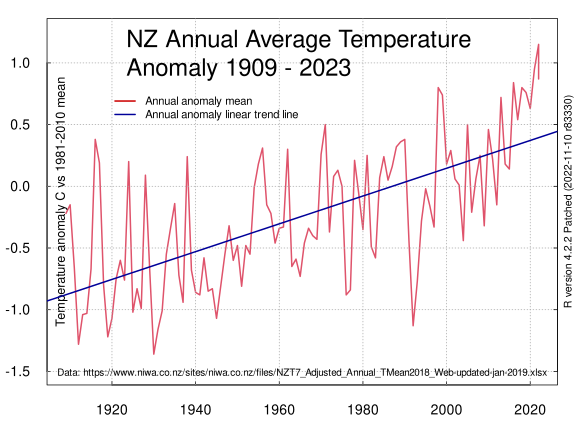

## New Zealand NIWA Seven-station series land surface temperature data 1909 to 2018. 

### Description

This repository features the code to download the New Zealand [NIWA Seven-station series](https://www.niwa.co.nz/our-science/climate/information-and-resources/nz-temp-record/seven-station-series-temperature-data) land surface temperature data and to create a chart.

R script

```{r}
library(here)
set_here()
library(readxl)
```

obtain data sheet (.xlsx format) from NIWA
```{r}
url <- c("https://www.niwa.co.nz/sites/niwa.co.nz/files/NZT7_Adjusted_Annual_TMean2018_Web-updated-jan-2019.xlsx")
file <- c("NZT7_Adjusted_Annual_TMean2018_Web-updated-jan-2019.xlsx")
download.file(url, file)
trying URL 'https://www.niwa.co.nz/sites/niwa.co.nz/files/NZT7_Adjusted_Annual_TMean2018_Web-updated-jan-2019.xlsx'
Content type 'application/vnd.openxmlformats-officedocument.spreadsheetml.sheet' length 22763 bytes (22 KB)
==================================================
downloaded 22 KB
```

List the sheets in the excel spreadsheet
```{r} 
excel_sheets("NZT7_Adjusted_Annual_TMean2018_Web-updated-jan-2019.xlsx")
[1] "NZT7_Adjusted_TMean2016_Web"
```
Read in temperature anomaly data

```{r}
t7data <-read_excel("NZT7_Adjusted_Annual_TMean2018_Web-updated-jan-2019.xlsx", sheet = "NZT7_Adjusted_TMean2016_Web", range ="Q12:Q122", col_names = T, skip =11,col_types = c("guess"))
```
Check object
```{r}str(t7data)
Classes ‘tbl_df’, ‘tbl’ and 'data.frame':	110 obs. of  1 variable:
 $ Anomaly: num  -0.22 -0.15 -0.66 -1.28 -1.04 -1.03 -0.67 0.38 0.19 -0.8 ...
```
Read in date data
```{r}
year <-read_excel("NZT7_Adjusted_Annual_TMean2018_Web-updated-jan-2019.xlsx", sheet = "NZT7_Adjusted_TMean2016_Web", range ="A12:A122", col_names = T, skip =11,col_types = c("guess"))
```
Check the object
```{r}
str(year) 
Classes ‘tbl_df’, ‘tbl’ and 'data.frame':	110 obs. of  1 variable:
 $ X__1: num  1909 1910 1911 1912 1913 . 
```

Combine date and temperature data into a dataframe 
```{r}
t7data<-cbind(year,t7data)
```

```{r}
str(t7data)
'data.frame':	110 obs. of  2 variables:
 $ X__1   : num  1909 1910 1911 1912 1913 ...
 $ Anomaly: num  -0.22 -0.15 -0.66 -1.28 -1.04 -1.03 -0.67 0.38 0.19 -0.8 ...
```
Assign names of vectors within the dataframe
```{r}
names(t7data)<-c("Year","Anomaly")
str(t7data)
 'data.frame':	110 obs. of  2 variables:
 $ Year   : num  1909 1910 1911 1912 1913 ...
 $ Anomaly: num  -0.22 -0.15 -0.66 -1.28 -1.04 -1.03 -0.67 0.38 0.19 -0.8 ...
 ```

Inspect last 5 rows of dataframe
```{r}
tail(t7data)
   Year Anomaly
105 2013    0.72
106 2014    0.18
107 2015    0.14
108 2016    0.84
109 2017    0.54
110 2018    0.80
```
add 2019 annual anomaly 0.76 C ref https://www.nzherald.co.nz/environment/news/article.cfm?c_id=39&objectid=12299091
```{r}
t7data <- rbind(t7data,c(2019,0.76))
```
add 2020 anomaly https://niwa.co.nz/climate/summaries/annual-climate-summary-2020 2020
```{r}
t7data <- rbind(t7data,c(2020,0.63))
```
add 2021 anomaly https://niwa.co.nz/climate/summaries/annual-climate-summary-2021
```{r}
t7data <- rbind(t7data,c(2021,0.95))
```

```{r}
write the datafame to a .csv file
```{r}
write.table(t7data, file = "niwa-t7data.csv", sep = ",", col.names = TRUE, qmethod = "double",row.names = FALSE)
```

create svg format chart with 14 pt text font and grid lines via 'grid' and linear trend line

```{r}
svg(filename="/home/user/R/nzt7/nzt7timeseries2021-720by540.svg", width = 8, height = 6, pointsize = 14, onefile = FALSE, family = "sans", bg = "white", antialias = c("default", "none", "gray", "subpixel"))  
par(mar=c(2.7,2.7,1,1)+0.1)
plot(t7data,tck=0.01,ylim=c(-1.5,1.25),axes=TRUE,ann=TRUE, las=1,col=2,lwd=2,type='l',lty=1)
grid(col="darkgray",lwd=1)
axis(side=4, tck=0.01, las=0,tick=TRUE,labels = FALSE)
mtext(side=1,cex=0.7,line=-1.3,"Data: https://www.niwa.co.nz/sites/niwa.co.nz/files/NZT7_Adjusted_Annual_TMean2018_Web-updated-jan-2019.xlsx")
mtext(side=3,cex=1.7, line=-4,expression(paste("NZ Annual Average Temperature \nAnomaly 1909 - 2021")) )
mtext(side=2,cex=0.9, line=-1.3,"Temperature anomaly C vs 1981-2010 mean")
mtext(side=4,cex=0.75, line=0.05,R.version.string)
abline(lm(t7data[["Anomaly"]]~t7data[["Year"]]),col="#000099",lwd=2,lty=1)
legend(1920, 0.8, bty='n',bg="white", cex = 0.8, c(paste("Annual anomaly", c("mean", "linear trend line"))),pch=c(NA,NA),lty=c(1,1),lwd=c(2,2),col=c("#CC0000","#000099"))
dev.off()
```



### License

#### ODC-PDDL-1.0

This data and the R scripts are made available under the Public Domain Dedication and License v1.0 whose full text can be found at: http://www.opendatacommons.org/licenses/pddl/1.0/. You are free to share, to copy, distribute and use the data, to create or produce works from the data and to adapt, modify, transform and build upon the data, without restriction.


#### Index of files

1. [NZT7_Adjusted_Annual_TMean2018_Web-updated-jan-2019.xlsx](NZT7_Adjusted_Annual_TMean2018_Web-updated-jan-2019.xlsx) (Data from NIWA)

2. [niwa-t7data.csv](niwa-t7data.csv) (processed temperature data)

3. [nzt7.r](nzt7.r)     (R script file of code to process data and to create chart)

4. [Licence.txt](Licence.txt) (Public Domain  Dedication and License v1.0 http://opendatacommons.org/licenses/pddl/1.0/)

